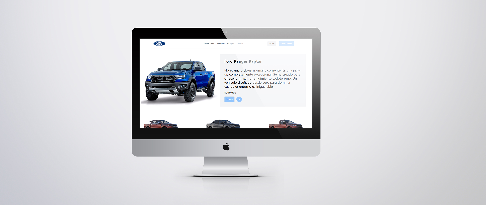

# Producto Ford

## Acerca del proyecto
Diseñamos una plantilla de un produto con sus detalles y para poder realizar la compra del mismo para contruirlo usamos una plantilla de un framework creado por [Orlando José Betancourth A](https://github.com/obetancourthunicah) con diferentes tecnologias como: handlebars, tailwind css... para construir el diseño.

Los cambios se encuentran en la ruta: **localhost:8080/product.html**

## Mockup


## Antes de comenzar
1. Ejecutar el siguente comando, para instalar los modulos y administrar las dependencias.
```bash
npm install
```
2. Ejecutar este comando por si se llega a tener problemas con la carga del diseño.
```bash
npm install --save-dev autoprefixer
```
3. Inicar el proyecto.
```bash
npm start
```
## Integrantes:

Owen Ariel Valle Turcios 
0318-2001-00020

Klisban Rodiney Morales
0801-1999-19211

Aldo Geovanni Osorio Rivera
0703-2000-00872

Cesar Ariel Mejía Gómez 
1201-1999-00871

Gustavo Elias Meza Matute 
1001-1999-00273

Yovany Hernandez Garcia
1306-1998-00185

Patrick David Soto
1101-2002-00040
